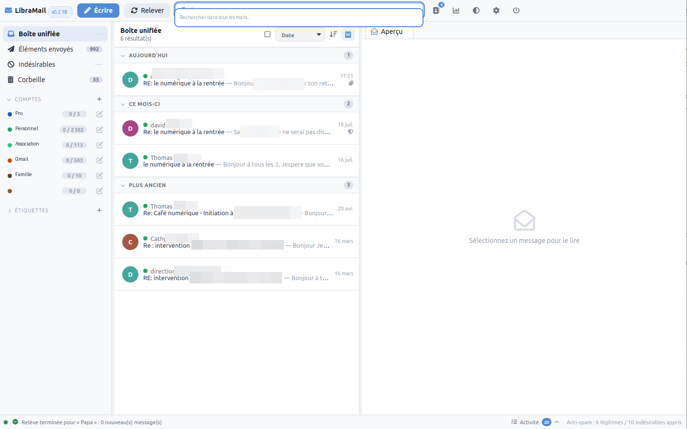

# FARO Mail

[](https://github.com/RayTrunk/faromail/releases)
[](https://github.com/RayTrunk/faromail/actions/workflows/verify.yml)
[](https://github.com/RayTrunk/faromail/actions/workflows/build.yml)
[](LICENSE)

> **English** · [Français](#français)

FARO Mail is a lightweight, local-first desktop email client built with
Neutralinojs and a self-contained Node.js engine. It manages several IMAP/SMTP
accounts without requiring Node.js to be installed on the target computer.



## Highlights

- Multiple IMAP and SMTP accounts with a unified inbox
- Incremental synchronisation, automatic startup check and cancellable activity
- Conversations, full-text search, date groups and unread/total counters
- Sent, spam and trash folders
- Labels directly from the message list
- Contacts, groups, avatars, trusted senders and address autocompletion
- Calendar with month, week, work-week and year views, ICS/ICAL/VCS/CSV import, read-only Internet ICS subscriptions and a collapsible main-window agenda pane
- Provider logos or custom account icons
- Compose, reply, reply all, forward, Cc, Bcc and attachments
- Per-account signatures, read receipt and delivery status requests
- Remote-content blocking and confirmation before opening external links
- Light and dark themes, French and English interfaces
- Complete ZIP backup and restore of settings, accounts, contacts, calendar and local mail
- Portable Linux and Windows packages with an embedded Node.js runtime

## Privacy

FARO Mail stores accounts, settings, the SQLite index and downloaded messages
locally in the `data/` directory. Public GitHub builds are always generated
without personal data. There is no FARO Mail cloud account and no telemetry.

**Never commit or publish the `data/` directory or a private build produced with
`--with-data`.** It may contain account credentials and complete messages.

## Download

Portable Linux and Windows builds are attached to each
[GitHub Release](https://github.com/RayTrunk/faromail/releases).

### Linux

Extract the archive and run:

```bash
chmod +x faromail faromail-app runtime/node/bin/node
./check_portable.sh
./faromail
```

The graphical interface requires GTK/WebKitGTK packages provided by the Linux
distribution.

### Windows

Extract the archive, run `check_portable.cmd`, then launch `FaroMail.exe`.
Microsoft Edge WebView2 is required by the Neutralino window.

## Build from source

```bash
# Linux public package, without personal data
./build_linux.sh --fresh-npm

# Windows public package, from Windows PowerShell
.\build_windows.ps1 --fresh-npm
```

Personal local packages may be built with `--with-data`, but must never be
uploaded to GitHub.

## Automated GitHub publication

This repository includes one command centre:

```bash
./github.sh check
./github.sh init
./github.sh build
./github.sh release 0.3.3
```

- `init` creates/configures the GitHub repository and pushes the source
- `build` asks GitHub Actions to build Linux and Windows, then downloads them
- `release` updates the version, pushes a tag and publishes both packages
- `check` verifies versions and prevents personal data from being tracked

Detailed instructions are available in [docs/PUBLISHING.md](docs/PUBLISHING.md).

## Project structure

```text
resources/             Neutralino HTML/CSS/JavaScript interface
engine/                Node.js IMAP/SMTP/SQLite engine
data/                  local private data, ignored by Git
build_linux.sh         self-contained Linux packaging
build_windows.ps1      self-contained Windows packaging
.github/workflows/     verification, builds and releases
```

## License

FARO Mail is distributed under the [Apache License 2.0](LICENSE).

---

# Français

FARO Mail est un client de messagerie de bureau léger et local, construit avec
Neutralinojs et un moteur Node.js autonome. Il gère plusieurs comptes IMAP/SMTP
sans exiger l'installation de Node.js sur l'ordinateur cible.


## Fonctions principales

- Plusieurs comptes IMAP et SMTP avec boîte unifiée
- Synchronisation incrémentale, relève au démarrage et activité interruptible
- Conversations, recherche plein texte et regroupement par période
- Compteurs de messages non lus et totaux pour chaque compte
- Dossiers Envoyés, Indésirables et Corbeille
- Étiquettes directement depuis la liste des messages
- Contacts, groupes, avatars, expéditeurs de confiance et autocomplétion
- Planning avec vues mois, semaine, semaine de travail et année, import ICS/ICAL/VCS/CSV, abonnements ICS Internet en lecture seule et volet agenda rétractable dans la fenêtre principale
- Logos de fournisseurs ou icônes de compte personnalisées
- Rédaction, réponse, réponse à tous, transfert, Cc, Cci et pièces jointes
- Signatures par compte, demandes d'accusé de lecture et de réception
- Blocage des contenus distants et confirmation avant ouverture des liens
- Thèmes clair et sombre, interfaces française et anglaise
- Sauvegarde et restauration ZIP des paramètres, comptes, contacts, planning et messages
- Paquets portables Linux et Windows avec Node.js embarqué

## Confidentialité

FARO Mail conserve localement les comptes, les paramètres, l'index SQLite et
les messages téléchargés dans le dossier `data/`. Les compilations publiques
GitHub sont toujours produites sans données personnelles. FARO Mail n'utilise
ni compte cloud propre ni télémétrie.

**Ne publiez jamais le dossier `data/` ni une compilation privée créée avec
`--with-data`.** Ils peuvent contenir les identifiants des comptes et les
messages complets.

## Téléchargement

Les versions portables Linux et Windows sont jointes à chaque
[publication GitHub](https://github.com/RayTrunk/faromail/releases).

### Linux

Décompressez l'archive puis lancez :

```bash
chmod +x faromail faromail-app runtime/node/bin/node
./check_portable.sh
./faromail
```

L'interface graphique utilise les bibliothèques GTK/WebKitGTK fournies par la
distribution Linux.

### Windows

Décompressez l'archive, lancez `check_portable.cmd`, puis `FaroMail.exe`.
La fenêtre Neutralino nécessite Microsoft Edge WebView2.

## Compilation depuis les sources

```bash
# Paquet Linux public, sans donnée personnelle
./build_linux.sh --fresh-npm

# Paquet Windows public, depuis PowerShell sous Windows
.\build_windows.ps1 --fresh-npm
```

Les compilations privées peuvent utiliser `--with-data`, mais ne doivent jamais
être envoyées sur GitHub.

## Publication GitHub automatisée

Un seul script sert de tableau de commande :

```bash
./github.sh check
./github.sh init
./github.sh build
./github.sh release 0.3.3
```

- `init` crée et configure le dépôt GitHub, puis envoie les sources
- `build` demande à GitHub Actions de compiler Linux et Windows et les télécharge
- `release` met à jour la version, pousse un tag et publie les deux paquets
- `check` contrôle les versions et bloque les données personnelles suivies par Git

Le mode d'emploi détaillé se trouve dans
[docs/PUBLISHING.md](docs/PUBLISHING.md).

## Licence

FARO Mail est distribué sous [licence Apache 2.0](LICENSE).

_Last documentation update / Dernière mise à jour : 19 August 2026 / 19 août 2026._
